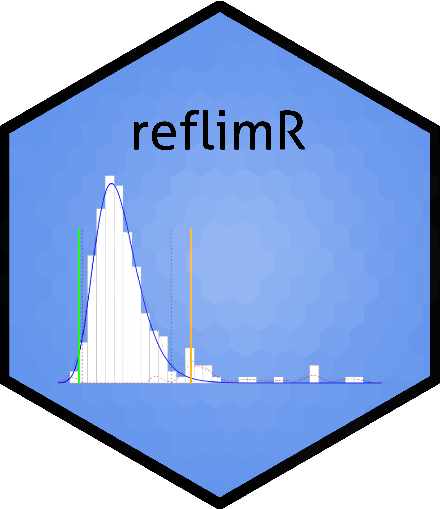
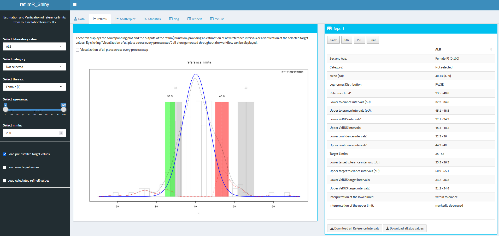

# Shiny App for reflimR




This Shiny App is based on the package **reflimR** for the estimation of reference limits from routine laboratory results.

## Installation 

**Method 1:**
Use the function ```runGitHub()``` from the package [shiny](https://cran.r-project.org/web/packages/shiny/index.html):

```bash
if("shiny" %in% rownames(installed.packages())){
  library(shiny)} else{install.packages("shiny")
  library(shiny)}
runGitHub("reflimR_Shiny", "SandraKla")
```

**Method 2** (not recommended):
Download the Zip-File from this Shiny App. Unzip the file and set your working direction to the path of the folder. 
The package [shiny](https://cran.r-project.org/web/packages/shiny/index.html) (≥ 1.7.1) must be installed before using the Shiny App:

```bash
# Test if shiny is installed:
if("shiny" %in% rownames(installed.packages())){
  library(shiny)} else{install.packages("shiny")
  library(shiny)}
```
And then start the app with the following code:
```bash
runApp("app.R")
```



The package [reflimR](https://github.com/reflim/reflimR) and [shinydashboard](https://cran.r-project.org/web/packages/shinydashboard/index.html) (≥ 0.7.2) is downloaded or imported when starting this app. The used [R](https://www.r-project.org)-Version must be ≥ 4.1.2 (2021-11-01).

### Preloaded dataset
Data from the [UC Irvine Machine Learning Repository](https://archive.ics.uci.edu/ml/datasets/HCV+data) showing AST data has been preloaded into this Shiny App.

### New data
These columns should be used for new data:

* **Category**: Name of the category ("reference") 
* **Age**: Age in years
* **Sex**: "m" for male and "f" for female
* **Value**: Column name is the analyte name, values are the laboratory measures

## Contact

You are welcome to:
- Submit suggestions and bugs at: https://github.com/SandraKla/reflimR_Shiny/issues
- Make a pull request on: https://github.com/SandraKla/reflimR_Shiny/pulls
- Write an email with any questions and problems to: s.klawitter@ostfalia.de
