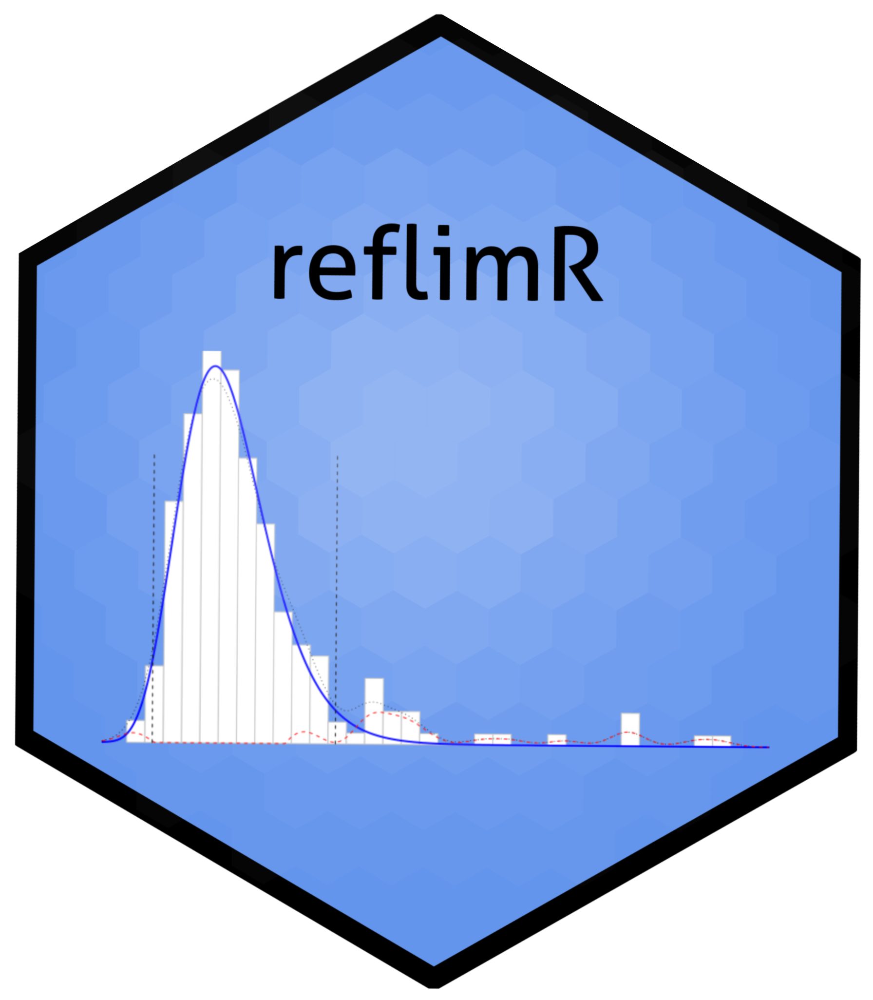

# Shiny App for reflimR


This Shiny App is based on the package [**reflimR**](https://cran.r-project.org/web/packages/reflimR/index.html) for the estimation and verification of reference limits from routine laboratory results.

## Installation 



**Method 1:**
Use the function ```runGitHub()``` from the package [shiny](https://cran.r-project.org/web/packages/shiny/index.html):

```bash
if("shiny" %in% rownames(installed.packages())){
  library(shiny)} else{install.packages("shiny")
  library(shiny)}
runGitHub("reflimR_Shiny", "SandraKla")
```

**Method 2**:
Download the Zip-File from this Shiny App. Unzip the file and set your working direction to the path of the folder. 
The package [shiny](https://cran.r-project.org/web/packages/shiny/index.html) (≥ 1.7.1) must be installed before using the Shiny App:

```bash
# Test if shiny is installed:
if("shiny" %in% rownames(installed.packages())){
  library(shiny)} else{install.packages("shiny")
  library(shiny)}
```
And then start the app with the following code:
```bash
runApp("app.R")
```


The package [reflimR](https://cran.r-project.org/web/packages/reflimR/index.html) (≥ 1.1.0) and [refineR](https://cran.r-project.org/web/packages/refineR/index.html) (≥ 2.0.0), [mclust](https://cran.r-project.org/web/packages/mclust/index.html) (≥ 6.1.2), [DT](https://cran.r-project.org/web/packages/DT/index.html) (≥ 0.33) and [shinydashboard](https://cran.r-project.org/web/packages/shinydashboard/index.html) (≥ 0.7.2) are downloaded or imported when starting this app. The used [R](https://www.r-project.org)-Version must be ≥ 4.5.2.

## Preloaded dataset
Data from the [UC Irvine Machine Learning Repository](https://archive.ics.uci.edu/ml/datasets/HCV+data) showing *livertests* has been preloaded into this Shiny App. In addition, the corresponding reference intervals are stored in *targetvalues*. The reference interval table has been derived from the data published in the [Clinical Laboratory Diagnostics](https://www.clinical-laboratory-diagnostics.com) by Lothar Thomas, MD.

## New data
These columns should be used for new data:

* **Category**:   Name of the category to filter the data
* **Age**:        Age in years
* **Sex**:        "m" for male and "f" for female
* **Value**:      Column name is the analyte name, values are the laboratory measures

The data from *livertests* serves as a [template](https://github.com/SandraKla/reflimR_Shiny/tree/main/www/template.csv). To load new data, the data should be in CSV format with values separated by semicolons (;), and decimal numbers should use a comma (,) as the decimal separator. The first row should contain column headers.

## Usage

On the left side, the sidebar allows you to select the laboratory parameter, category, age and gender group. In the “Target Values” section, you can load target values from *targetvalues*, load reference intervals estimated with *refineR*, or manually enter custom values.
In the “Upload” tab, new datasets can be uploaded. The main tab, “reflimR”, displays the corresponding plot and the outputs of the ```reflim()``` function, providing an estimation of new reference intervals or a verification of the selected target values. 
By clicking “Visualization of all plots across every process step”, all plots generated throughout the workflow can be displayed.

If, during the verification with *reflimR* and its target values or own target values, a yellow or red bar appears, a follow-up analysis using *refineR* is recommended in the "refineR" tab. The resulting reference intervals from *refineR* can be used as new target values and re-verified with *reflimR*.
If all indicators turn green, this suggests that the manufacturer’s target values are likely incorrect. If one or more indicators remain yellow or red, the data are considered too challenging for indirect methods. This assumption can be further evaluated in the “mclust” tab using a Gaussian mixture model (*mclust*).

zlog values are calculated from the dataset and the calculated reference intervals under the "zlog" tab. The lower reference limits (LL) and upper reference limits (UL) can transform any result x into a zlog value using the following equation: 

zlog(x) = (log(x)–(log(LL)+ log(UL))/2)*3.92/(log(UL)–log(LL))

Values ranging from –1.96 to 1.96 are considered normal, while values below –5 and above 5 indicate pathological conditions.

## Contact

You are welcome to:
- Submit suggestions and bugs at: https://github.com/SandraKla/reflimR_Shiny/issues
- Make a pull request on: https://github.com/SandraKla/reflimR_Shiny/pulls
- Write an email with any questions and problems to: s.klawitter@ostfalia.de

Link to the publication: 
- [A Novel Tool for the Rapid and Transparent Verification of Reference Intervals in Clinical Laboratories](https://doi.org/10.3390/jcm13154397)

## Disclaimer

Only anonymized data may be uploaded to this application. This application is provided “as is” and “as available”, without any express or implied warranties of any kind. No warranty is given regarding the accuracy, completeness, reliability, or timeliness of the results. The results are provided for informational and research purposes only and must not be used for diagnosis, treatment, prevention, or any form of clinical or medical decision-making. This application is not a medical device or medical product and does not replace professional medical advice. To the fullest extent permitted by law, the author disclaims all liability for any direct, indirect, incidental, consequential, or special damages arising from the use of this application or its results. Use of this application is entirely at your own risk.