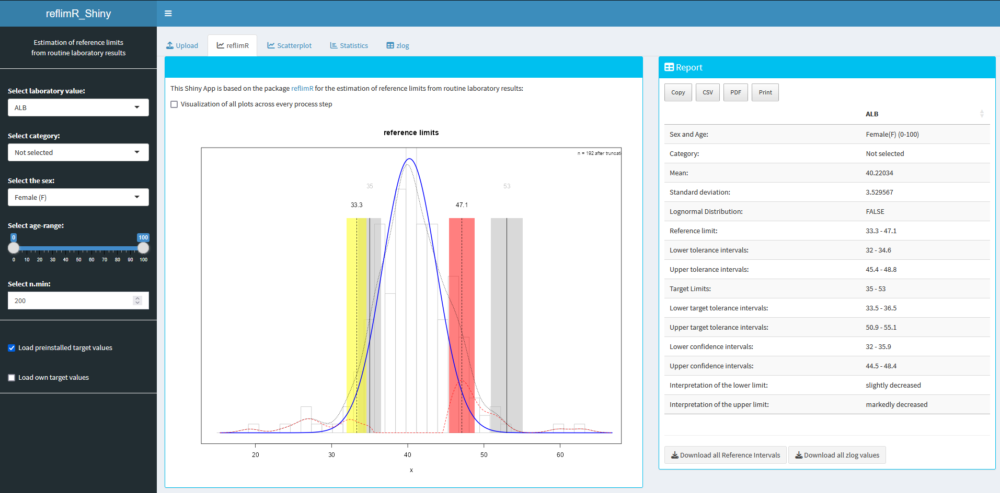

# Shiny App for reflimR


This Shiny App is based on the package [**reflimR**](https://cran.r-project.org/web/packages/reflimR/index.html) for the estimation of reference limits from routine laboratory results.

## Installation 


**Method 1:**
Use the function ```runGitHub()``` from the package [shiny](https://cran.r-project.org/web/packages/shiny/index.html):

```bash
if("shiny" %in% rownames(installed.packages())){
  library(shiny)} else{install.packages("shiny")
  library(shiny)}
runGitHub("reflimR_Shiny", "SandraKla")
```

**Method 2**:
Download the Zip-File from this Shiny App. Unzip the file and set your working direction to the path of the folder. 
The package [shiny](https://cran.r-project.org/web/packages/shiny/index.html) (≥ 1.7.1) must be installed before using the Shiny App:

```bash
# Test if shiny is installed:
if("shiny" %in% rownames(installed.packages())){
  library(shiny)} else{install.packages("shiny")
  library(shiny)}
```
And then start the app with the following code:
```bash
runApp("app.R")
```



The package [reflimR](https://cran.r-project.org/web/packages/reflimR/index.html) (≥ 1.0.6), [DT](https://cran.r-project.org/web/packages/DT/index.html) (≥ 0.33) and [shinydashboard](https://cran.r-project.org/web/packages/shinydashboard/index.html) (≥ 0.7.2) is downloaded or imported when starting this app. The used [R](https://www.r-project.org)-Version must be ≥ 4.3.2.

## Preloaded dataset
Data from the [UC Irvine Machine Learning Repository](https://archive.ics.uci.edu/ml/datasets/HCV+data) showing *livertests* has been preloaded into this Shiny App. In addition, the corresponding reference intervals are stored in *targetvalues*. The reference interval table has been derived from the data published in the [Clinical Laboratory Diagnostics](https://www.clinical-laboratory-diagnostics.com) by Lothar Thomas, MD.

## New data
These columns should be used for new data:

* **Category**:   Name of the category to filter the data
* **Age**:        Age in years
* **Sex**:        "m" for male and "f" for female
* **Value**:      Column name is the analyte name, values are the laboratory measures

The data from *livertests* serves as a [template](https://github.com/SandraKla/reflimR_Shiny/tree/main/www/template.csv). To load new data, the data should be in CSV format with values separated by semicolons (;), and decimal numbers should use a comma (,) as the decimal separator. The first row should contain column headers.

## Usage

On the left side, you can use the sidebar to choose the laboartory parameter, category and age and gender. Below in the "Target Values" section, you can load the data from *targetvalues* or enter your own values. In the "Upload" tab, you can upload new data. In the main tab "reflimR", you will see the corresponding plot and the outputs from ```reflimR()```. By clicking on "Visualization of all plots across every process step", all the plots from the different steps can be displayed.

zlog values are calculated from the dataset and the calculated reference intervals under the "zlog" tab. The lower reference limits (LL) and upper reference limits (UL) can transform any result x into a zlog value using the following equation: 

zlog(x) = (log(x)–(log(LL)+ log(UL))/2)*3.92/(log(UL)–log(LL))

Values ranging from –1.96 to 1.96 are considered normal, while values below –5 and above 5 indicate pathological conditions.

## Contact

You are welcome to:
- Submit suggestions and bugs at: https://github.com/SandraKla/reflimR_Shiny/issues
- Make a pull request on: https://github.com/SandraKla/reflimR_Shiny/pulls
- Write an email with any questions and problems to: s.klawitter@ostfalia.de